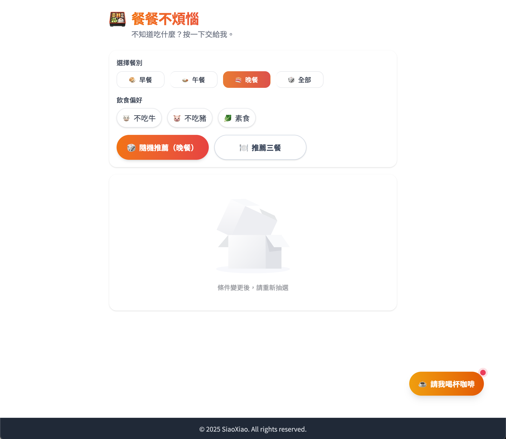
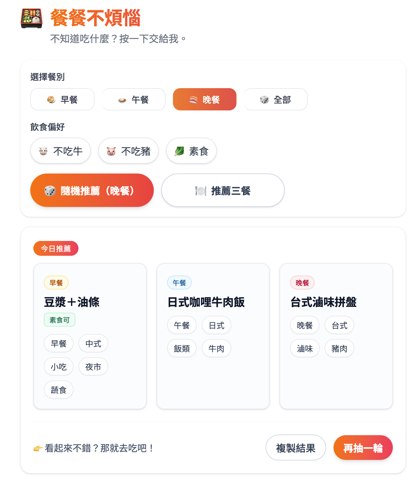
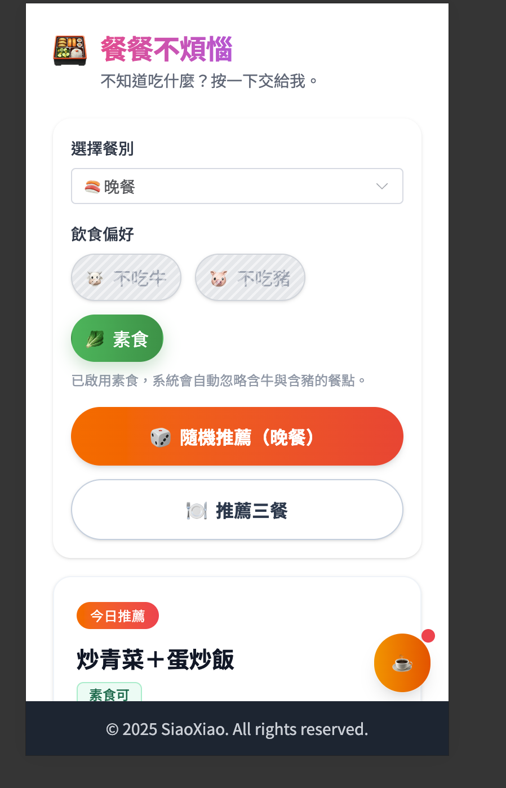

<h1 align="center">餐餐不煩惱 · Food Recommender</h1>

  
  
  
  
  

<h2>
<a href="https://side-project-food-recommend.vercel.app/">
 demo here
</a>
</h2>

## 📄 Description

Food Recommender 是一個幫助解決「今天要吃什麼？」的小工具。
支援單一隨機推薦或一次推薦三餐，並可依照飲食偏好（素食、不吃牛、不吃豬）快速篩選。

介面以 Vue 3 + Vite 打造，採用 TailwindCSS 與 Element Plus，同時優化行動裝置使用體驗。

**Key Features:**
- Vite: 採用最新 Vite，開發與建置快速。
- Vue 3: 核心框架，搭配 Composition API 架構。
- TailwindCSS: Utility-first 的響應式設計。
- Element Plus: 現成元件庫，彈窗、提示訊息等 UI 元件。
- ESLint + Prettier: 保持代碼風格一致。

## 🚀 Features

- 單一隨機推薦（依照餐別顯示早餐、午餐、晚餐或全部）
- 一鍵推薦三餐（早餐、午餐、晚餐合併呈現）
- 飲食偏好：素食 / 不吃牛 / 不吃豬
- 結果卡片：進場動畫、複製到剪貼簿、再抽一次
- 手機優化：避免雙擊縮放、按鈕固定寬度避免跳動

## 📦 Setup & Development Server

1. Installation: Clone the repository and run `npm install` to install dependencies.
2. Development: Run `npm run dev` to start the development server with hot module replacement.
3. Open `http://localhost:5174/` in your browser.
